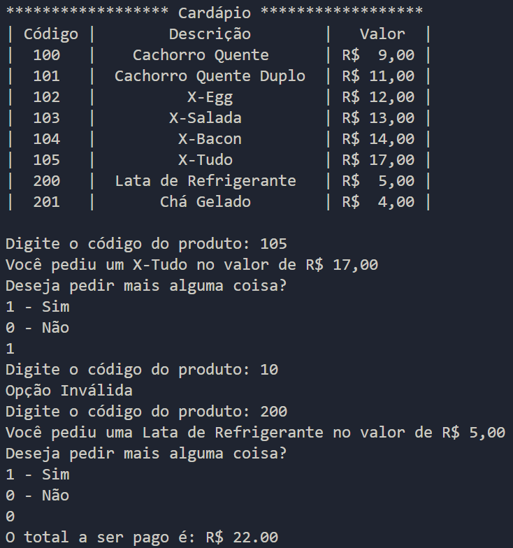

## Cardápio para Lanchonete

**Enunciado**: Você e sua equipe de programadores foram contratados para desenvolver um app de vendas para uma lanchonete. Você ficou com a parte de desenvolver a interface do cliente para retirada do produto. 

A lanchonete possui a seguinte tabela de produtos listados com seus códigos, descrições e valores:

|  Código  |        Descrição        | Valor (R$)  |
|:--------:|:-----------------------:|:-----------:|
|    100   |     Cachorro-quente     |     9,00    |
|    101   |  Cachorro-quente Duplo  |    11,00    |
|    102   |          X-Egg          |    12,00    |
|    103   |        X-Salada         |    13,00    |
|    104   |         X-Bacon         |    14,00    |
|    105   |         X-Tudo          |    17,00    |
|    200   |   Refrigerante de Lata  |     5,00    |
|    201   |       Chá Gelado        |     4,00    |

**Elabore um programa em Python que:**

1. Entre com o código do produto desejado;
2. Pergunte se o cliente quer pedir mais alguma coisa (se sim, repita o passo 2. Caso contrário, ir para próximo passo);
3. Encerre a conta do cliente com o valor total; 
4. Deve-se utilizar estruturas *if*, *elif* e *else* **(exigência 1 de 3)**;
5. Se a pessoa digitar um *número* diferente dos que estão na tabela, mostre na tela: *'opção inválida'* e volte para o menu **(exigência 2 de 3)**;
6. Deve-se utilizar *while*, *break*, *continue* **(exigência 3 de 3)**.
    * (dica: utilize o *continue* dentro *else* para verificar a opção inválida);
    * (dica: utilize o *break* dentro *elif* para verificar a opção sair).

**Teste:**

* Colocar um exemplo de SAIDA DE CONSOLE com dois pedidos
* Colocar um exemplo de SAIDA DE CONSOLE com erro ao digitar no pedido

---

**Resultado:**

