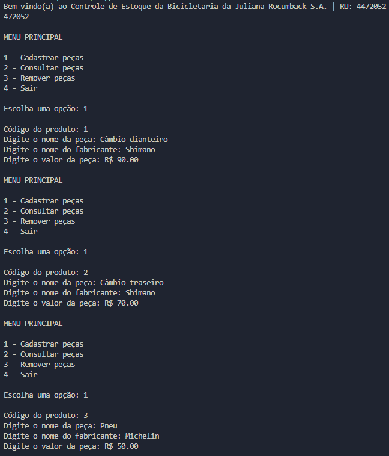
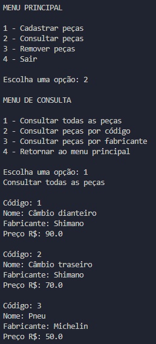
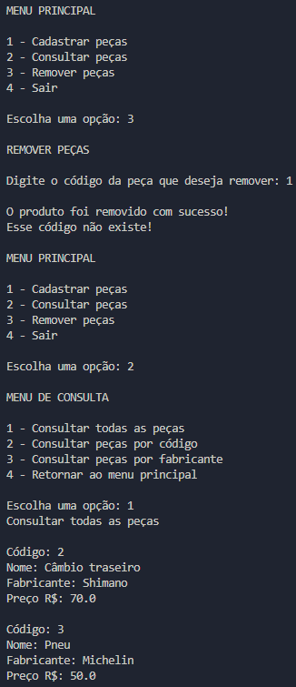

## Controle de estoque

**Enunciado:** Imagine que você está desenvolvendo um software de controle de estoque para uma bicicletaria. Este software deve ter o seguinte menu e opções:  

* Cadastrar Peça
* Consultar Peça
    * Consultar Todas as Peças
    * Consultar Peças por Código
    * Consultar Peças por Fabricante
    * Retornar
* Remover Peça 
* Sair 

**Elabore um programa em Python que:**

* Deve-se codificar uma função '*cadastrarPeca*' **(exigência 1)**;
    * Essa função receberá como parâmetro um código exclusivo para cada peça cadastrado (dica: utilize um contador como parâmetro);
    * Dentro da função, pergunte o nome da peça;
    * Dentro da função, pergunte o fabricante da peça; 
    * Dentro da função, pergunte o valor da peça;
    * Cada peça cadastrada deve ter os seus dados armazenados num dicionário.
* Deve-se codificar uma função '*consultarPeca*' **(exigência 2)**; 
    * Dentro da função, deve-se ter um menu com as seguintes opções: 
        * Consultar Todas as Peças;
        * Consultar Peças por Código; 
        * Consultar Peças por Fabricante; 
        * Retornar.
* Deve-se codificar uma função chamada '*removerPeca*' **(exigência 3)**.
    * Dentro da função, pergunte qual é o código do produto que deseja ser removido do cadastro (da lista de dicionário).

**Teste:**

* Colocar um exemplo de SAIDA DO CONSOLE com o cadastro de 3 (ou mais) peças. Sendo 2 delas do mesmo fabricante
* Colocar um exemplo de SAIDA DO CONSOLE com a consulta a todas as peças cadastradas
* Colocar um exemplo de SAIDA DO CONSOLE com uma consulta por código
* Colocar um exemplo de SAIDA DO CONSOLE com uma consulta por fabricante
* Colocar um exemplo de SAIDA DO CONSOLE ao remover um cadastro e mostrando depois todos os cadastros

---

**Resultado:**

*Cadastrar as 3 peças*  

*Consultar as peças por: todas, código e fabricante*    

    
*Remover peça*  

