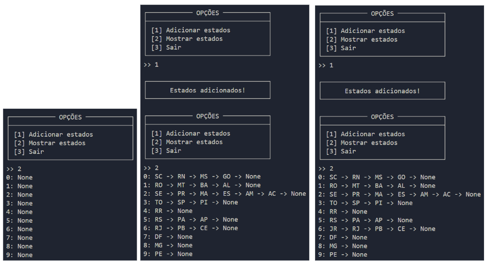

## Emplacamento de veículos

**Enunciado**: Com o objetivo de criar um sistema novo de emplacamento de veículos, deputados do Distrito Federal – DF, decidiram que o último número da placa dos veículos, irá representar o estado de registro dele. Para isso, sua equipe de desenvolvedores foi encarregada de desenvolver uma Tabela Hash com endereçamento em cadeia de 10 posições (cada posição do vetor deve ser uma lista encadeada), representando os números de 0 a 9 que irão representar os 26 estados e o Distrito Federal (total 27). 

 

**A função hash deve seguir as seguintes regras:**

* A entrada da função hash deve ser uma string com 2 letras, representando a sigla do estado e/ou distrito federal. 

* Caso a sigla seja DF (Distrito Federal), por questões de superstição, os deputados solicitaram que o retorno da função seja 7 sempre. 

* Caso contrário, a função deve retornar a posição com base no valor ASCII das duas letras e seguindo a seguinte regra: 

$$
posição = \frac{(CHAR1_{ASCII} + CHAR2_{ASCII})}{MOD 10}
$$
 

Onde $CHAR1_{ASCII}$ e $CHAR2_{ASCII}$ são os valores ASCII da primeira e segunda letra, respectivamente (Tabela ASCII).

**Elabore um programa em Python que:** 

1. Deve-se implementar a tabela Hash com 10 posições, onde inicialmente todas as posições possuem valor *None* [EXIGÊNCIA DE CÓDIGO 1 de 7]; 

2. Deve-se implementar as *Listas Encadeadas Simples* em que: [EXIGÊNCIA DE CÓDIGO 2 de 7]; 

    - O Nodo representa um Estado contendo: *sigla*, *nomeEstado* e um ponteiro para o *próximo*; 

    - As 10 posições da tabela hash, representam a cabeça de cada lista (*head*). 

3. Deve-se implementar a inserção no início da lista encadeada (cada elemento novo deve ser sempre *inserido no início da lista*) [EXIGÊNCIA DE CÓDIGO 3 de 7]; 

4. Deve-se implementar a impressão da tabela hash, onde devem ser impressas as *siglas* de todos os nodos que estão na tabela hash *separados por posição* [EXIGÊNCIA DE CÓDIGO 4 de 7]; 

5. Deve-se implementar a função hash, conforme enunciado. [EXIGÊNCIA DE CÓDIGO 5 de 7]; 

6. Deve-se implementar a inserção dos estados e distrito federal (*todos os 27 com nome e sigla*) na tabela hash utilizando a função hash (não precisa solicitar ao usuário, pode inserir no código mesmo) [EXIGÊNCIA DE CÓDIGO 6 de 7]; 

7. Deve-se inserir na Tabela, além dos estados e distrito federal, um estado fictício, sendo que esse estado tenha seu *nome completo*, e como siglas, a primeira letra do seu nome e a primeira letra do seu último sobrenome. [EXIGÊNCIA DE CÓDIGO 7 de 7];

**Teste:** para testar o software, execute os seguintes passos e apresente a saída do console conforme exemplo de saída de console: 

1. Deve-se apresentar na saída de console, a impressão da tabela hash antes de inserir qualquer informação [EXIGÊNCIA DE SAÍDA DE CONSOLE 1 de 3]; 

2. Deve-se apresentar na saída de console, a impressão da tabela hash após inserir os 26 estados e o Distrito Federal - DF [EXIGÊNCIA DE SAÍDA DE CONSOLE 2 de 3];  

3. Deve-se apresentar na saída de console, a impressão da tabela hash após inserir os 26 estados, Distrito Federal – DF e o estado fictício com seu nome completo. [EXIGÊNCIA DE SAÍDA DE CONSOLE 3 de 3];
---
**Resultado:**

