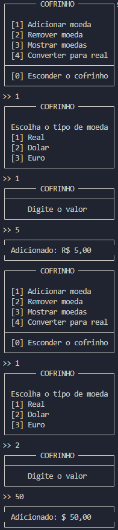
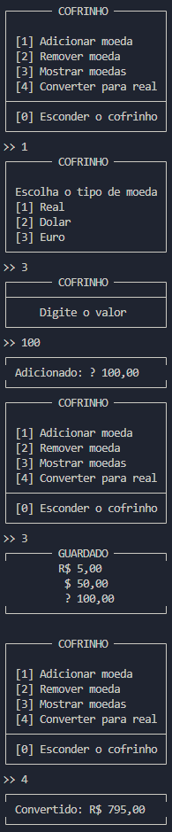
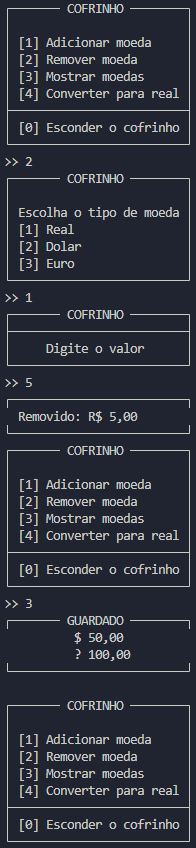

## Porquinho

**Enunciado:** O trabalho consiste em implementar um pequeno sistema que emula um "Cofrinho 
de moedas" em Java. Crie um menu em que é oferecido ao usuário:

* Adicionar moedas de diferentes valores e países em seu cofrinho
* Remover moedas específicas do cofrinho.
* Listar todas as moedas que estão dentro do cofrinho
* Calcular quanto dinheiro existe no cofrinho convertido para Real

O objetivo principal do trabalho é avaliar o bom uso do conceito de herança e 
polimorfismo. O projeto deve possuir uma classe Principal além das classes descritas no 
diagrama UML abaixo.

A classe Cofrinho deve possuir como atributo uma coleção de Moedas, que por sua 
vez é uma classe mãe abstrata de outras classes específicas de Dolar, Euro, Real, etc... A 
coleção de Moedas pode ser implementada utilizando um ArrayList, ou qualquer outra 
estrutura de dados que julgue pertinente.

Demais detalhes de implementação ficam a cargo do aluno que pode desenvolver 
também classes extras ou adicionar métodos e atributos conforme julgar necessário.

---

**Resultado:**

    
    
    

