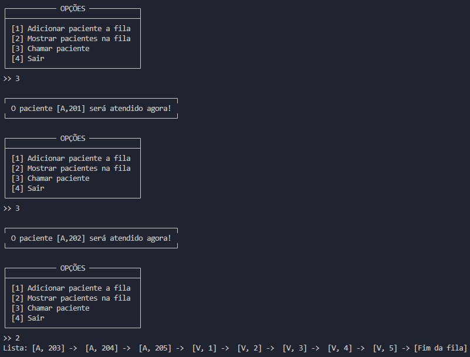

## Sistema de triagem

**Enunciado:** Com a finalidade de melhorar o atendimento e priorizar os casos mais urgentes, a direção de um hospital criou um sistema de triagem em que um profissional da saúde classifica a ordem de atendimento com base numa avaliação prévia do paciente, entregando-lhe um cartão numerado verde (V) ou amarelo (A), que define o menor ou maior grau de urgência da ocorrência, respectivamente.

Para informatizar esse processo, a direção do hospital contratou você para desenvolver uma fila de chamada seguindo as seguintes regras: 

* Pacientes com cartão numerado amarelo (A) são chamados antes dos pacientes com cartão numerado verde (V).
* Entre os pacientes com cartão numerado amarelo (A), os que tem numeração menor são atendidos antes. 
* Entre os pacientes com cartão numerado verde (V), os que tem numeração menor são atendidos antes. 
* As numerações dos cartões amarelos (A) iniciam em 201. 
* As numerações dos cartões verdes (V) inicial em 1. 

**Elabore um programa em Python que:**

1. Deve-se implementar uma *Lista Encadeada Simples* em que: [EXIGÊNCIA DE CÓDIGO 1 de 7]; 
    - O Nodo representa um cartão numerado contendo: *número*, *cor* e um ponteiro para o *próximo*; 

    - A lista contém um ponteiro para a cabeça da lista (*head*); 

 2. Deve-se implementar a função *inserirSemPrioridade(nodo)* em que: [EXIGÊNCIA DE CÓDIGO 2 de 7]; 

    - Deve-se andar pela lista a partir da cabeça (*head*) e inserir o nodo no *final da lista*. 

 3. Deve-se implementar a função *inserirComPrioridade(nodo)* em que: [EXIGÊNCIA DE CÓDIGO 3 de 7]; 

    - Deve-se andar pela lista a partir da cabeça (*head*) e inserir o nodo *após todos os nodos com cor “A”* que estão na lista. 
    - O nodo inserido deve *sempre* estar antes de todos os nodos com cor “V”. 

 4. Deve-se implementar a função *inserir()* em que: [EXIGÊNCIA DE CÓDIGO 4 de 7]; 

    - Deve-se solicitar ao usuário a cor (“A” ou “V”) e o número (inteiro). 
    - Deve-se criar um nodo com a cor e o número fornecidos pelo usuário. 
    - Se a lista estiver vazia, a cabeça (*head*) da lista deve apontar para o nodo criado. 
    - Senão, se a cor do nodo for “V”, deve-se chamar a função *inserirSemPrioridade(nodo)*. 
    - Senão, se a cor do nodo for “A”, deve-se chamar a função *inserirComPriordade(nodo)*. 

 5. Deve-se implementar a função *imprimirListaEspera()* em que: [EXIGÊNCIA DE CÓDIGO 5 de 7]; 

    - Deve-se imprimir todos os cartões e seus respectivos números a partir do primeiro até o último da lista. 

 6. Deve-se implementar a função *atenderPaciente()* em que: [EXIGÊNCIA DE CÓDIGO 6 de 7]; 

    - Deve-se remover o primeiro paciente da fila e imprimir uma mensagem chamando o paciente para atendimento informando o número do seu cartão. 

 7. Deve-se implementar um menu para utilização do sistema em que: [EXIGÊNCIA DE CÓDIGO 7 de 7]; 

    - Deve-se apresentar as opções (1 – adicionar paciente a fila, 2 – mostrar pacientes na fila, 3 – chamar paciente, 4 – sair) 
    - Se escolhida a opção 1, chamar a função inserir(). 
    - Se escolhida a opção 2, chamar a função imprimirListaEspera(). 
    - Se escolhida a opção 3, chamar a função atenderPaciente(). 
    - Se escolhida a opção 4, encerrar o programa. 
    - Se escolhida uma opção diferente as opções disponíveis, voltar ao item G.a. 

 
**Teste:**

Para testar o software, execute os seguintes passos e apresente a saída do console: 

1. Deve-se testar o sistema inserindo três (3) pacientes com cartão de cor “V”, dois (2) pacientes com cartão de cor “A”, dois (2) pacientes com cartão “V” e três (3) pacientes com cartão de cor “A”, *nessa respectiva ordem*. [EXIGÊNCIA DE SAÍDA DE CONSOLE 1 de 3]; 

2. Deve-se apresentar na saída de console a impressão da lista de espera (opção 2 do menu principal). [EXIGÊNCIA DE SAÍDA DE CONSOLE 2 de 3];   

3. Deve-se apresentar na saída de console o atendimento de dois (2) pacientes (opção 3 do menu principal) e em seguida mostrar a lista de espera (opção 2 do menu principal). [EXIGÊNCIA DE SAÍDA DE CONSOLE 3 de 3];

---

**Resultado:**

*Adicionar pacientes na fila*    

*Mostrar pacientes*  

*Chamar pacientes*

